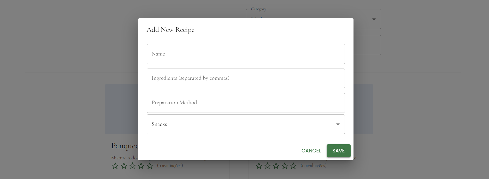
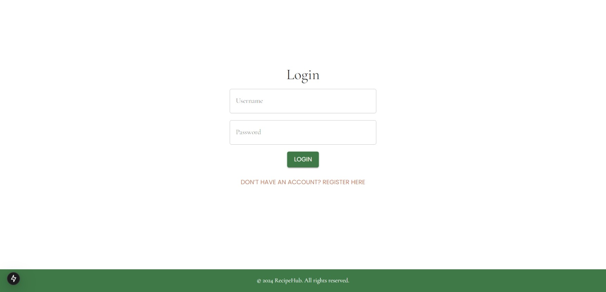
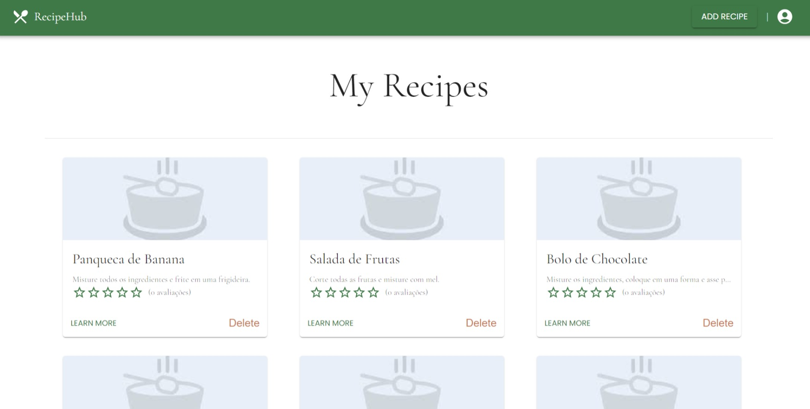
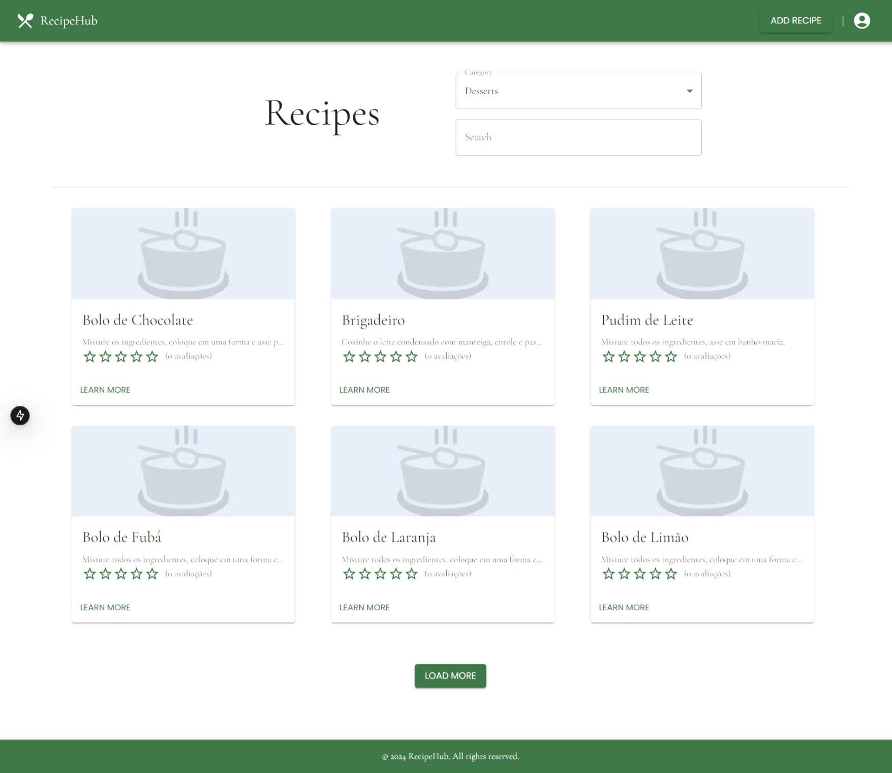

# Catálogo de Receitas - Frontend

Este projeto é a implementação do front-end de um sistema de gestão de receitas de cozinha, com autenticação e sistema de cadastro de usuários. Ele se conecta a uma API RESTful construída com NestJS, permitindo a criação, visualização, edição e exclusão de receitas.

### Repositório Backend
- **Backend**: [Catálogo de Receitas - Backend](https://github.com/SEU-REPOSITORIO-BACKEND)

---

## Tecnologias Utilizadas

- **Framework**: Next.js
- **Design System**: Material UI
- **Design**: Baseado no projeto "Kitchen Tales - A Recipe Sharing Website" de Pearl Pereira ([Figma](https://www.figma.com/community/file/1333514044260264226/kitchen-tales-a-recipe-sharing-website))
- **Autenticação**: JWT (JSON Web Tokens)
- **Gerenciamento de Estado**: Context API (para controle de autenticação)
- **Validação de Dados**: Formulários com validação de campos feita no backend
- **Pesquisa**: Pesquisa de receitas por palavra-chave com debounce para melhorar a performance
- **Mensagens de Erro**: Exibição de mensagens de erro provenientes do backend quando necessário

## Diferenciais Implementados

- **Autenticação Contextual**: Renderização condicional de componentes, dependendo do estado de autenticação do usuário (usando Context API).
- **Exibição de Mensagens de Erro**: Mensagens claras e concisas que informam o usuário sobre erros provenientes do backend.
- **Pesquisa Avançada**: Implementação de pesquisa por palavra-chave com debounce para otimização da performance da aplicação.


---

## Design Pattern

A aplicação segue uma **arquitetura modular**, com separação clara de responsabilidades entre:
- **Páginas**: Cada página é responsável por uma funcionalidade específica do sistema.
- **Componentes**: Reutilizáveis, sendo responsáveis por partes específicas da UI, como formulários, listas de receitas, etc.
- **Contextos**: Usados para gerenciar o estado global da aplicação, como o estado de autenticação do usuário.

---

## Estrutura do Projeto

```
recipe-hub-webapp
├── app
│   ├── auth
│   │   ├── login
│   │   │   └── page.tsx
│   │   └── register
│   │       └── page.tsx
│   ├── recipes
│   │   ├── [id]
│   │   │   └── page.tsx
│   │   ├── my-recipes
│   │   │   └── page.tsx
│   ├── layout.tsx
│   └── page.tsx
├── components
│   ├── (componentes e hooks)
├── contexts
├── middlewares
├── styles
└── utils
```

---

## Funcionalidades

### **Autenticação de Usuário**
- **Tela de Registro de Usuário**: Permite que novos usuários se registrem no sistema.
- **Tela de Login**: Permite que usuários existentes se autentiquem usando JWT.

### **Gestão de Receitas**
- **Tela de Listagem de Receitas**: Exibe todas as receitas, com filtros por categoria e pesquisa por palavras-chave.
- **Tela de Minhas Receitas**: Exibe as receitas criadas pelo usuário logado, com a opção de deletá-las.
- **Tela de Adição de Receita**: Permite ao usuário adicionar novas receitas, com campos para nome, ingredientes, modo de preparo e categoria.
- **Tela de Detalhes da Receita**: Exibe as informações detalhadas de uma receita específica.


---

## Imagens de algumas telas

(não incluem todas as funcionalidades, como mensagens de sucesso e erro)

**Tela de Adicionar Receita**  


**Tela de Login**  


**Minhas Receitas**  


**Listagem de Receitas**  

